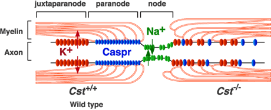
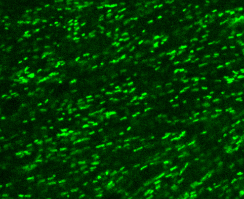
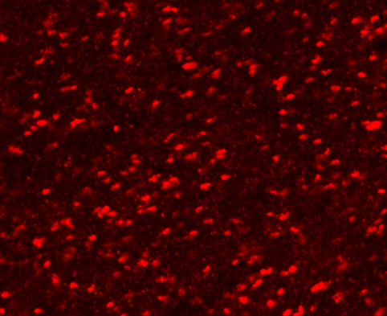
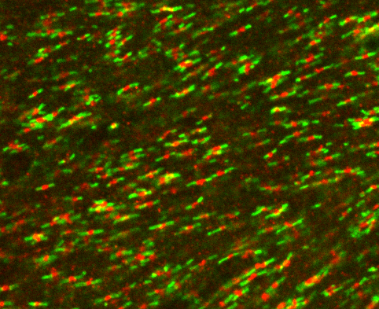
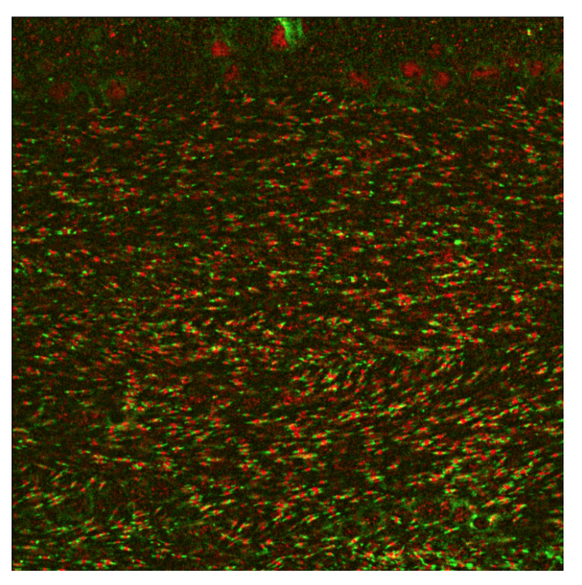
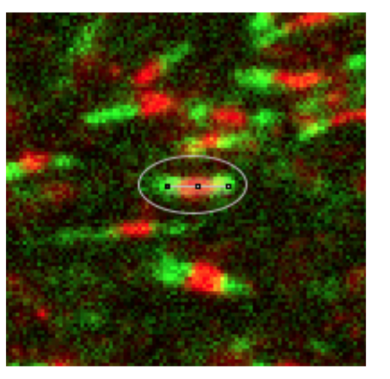
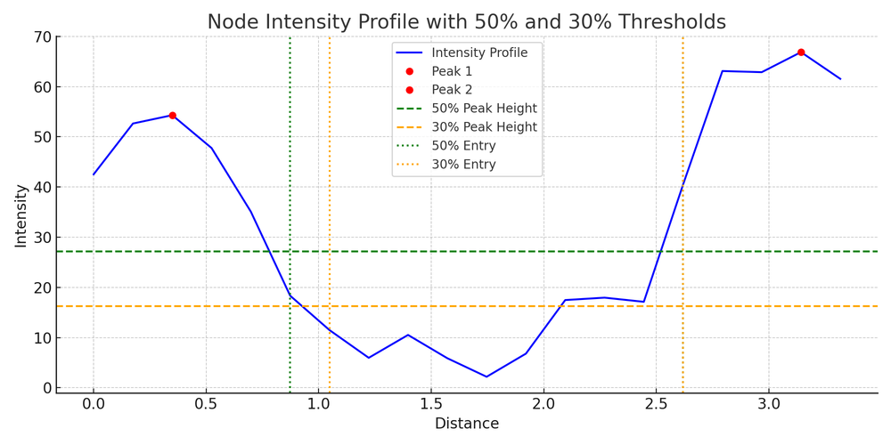
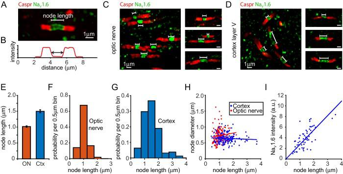

# Project brief — automated detection of Nodes of Ranvier

Durable ingest of the owner's overview document (`NoR_detection_project.pdf`, 4 pages). Session
upload paths do not persist, so **this file and [`figures/`](figures/) are the record** — the PDF
itself is not the source of truth for any later session.

The verbatim extracted text is kept beside it in
[`project-overview-extracted-text.txt`](project-overview-extracted-text.txt), so a wording question
can be settled without the original.

---

## 1. What a Node of Ranvier is, for this project's purposes

A short, exposed segment of axon between two consecutive myelin segments, densely packed with
sodium channels (notably Nav1.6) that generate the action potential and enable saltatory
conduction. Node **structure and length** govern conduction speed and fidelity; **elongation** and
**reduced node number** are observed in models of myelin injury and are linked to impaired axonal
conduction. Automated quantification of node number and length is therefore the research tool this
project is building.

*Overview Figure 1 — the node (Na+, green), the flanking paranodes (Caspr, blue) and the
juxtaparanodes (K+, red). Note this schematic's colours are **cartoon domain colours and
have nothing to do with the channel colours in our images**; it is a published wild-type /
`Cst`-null comparison, and only the wild-type (left) half describes our data.*

Wider domain background — what Caspr and Nav1.6 actually are, why the Caspr–Nav–Caspr
arrangement is the reliable signature, and what pathology does to it — is in
[`literature/node-biology.md`](literature/node-biology.md).

## 2. The staining, and what arrives as input

Two immunofluorescent stains imaged together, one per colour channel:

| Stain | Labels | Colour in the owner's images |
|---|---|---|
| **Caspr** | the two **paranodal** regions flanking the node on either side | green |
| **Nav1.6** | the sodium channels clustered **inside** the node, in the gap between the two Caspr blobs | red |

Raw microscope files are **multi-channel** and typically also carry a **DAPI** (nuclei) channel.
DAPI is not used for node identification and is **discarded during preprocessing**.

Human identification is done on the **merged** Caspr + Nav1.6 image. The overview is
explicit that the software is **not required to work that way**: detecting Caspr blobs and
Nav1.6 blobs independently per channel and combining the results afterwards is an
allowed — and possibly better — strategy, useful for validating detections or as an alternative
detection route.

> **Colour assignment is a per-source convention, not a fact about the molecules.** The owner's
> images use Caspr = green / Nav = red. The reference figure reproduced as overview Figure 2 uses
> the **opposite** mapping (Caspr red, Nav green), and so does much of the published literature.
> Nothing downstream may key on colour identity without reading it from the acquisition metadata
> or a stated per-dataset convention.

### The example data shown in the overview

*Overview Figure 3 — the two individual channels and the merged image. Measured from the extracted
bitmaps, the merged panel is the exact per-pixel sum of the two: green is carried only by Caspr and
red only by Nav1.6, with no bleed. The two channels are cleanly separable in this
example.*

*Overview Figure 4 — a full-field image (corpus callosum) of the kind used as input. This is the
regime the MVP must survive: **hundreds of candidate blobs, densely packed, many axons crossing**,
and a non-uniform background (note the brighter blur across the top of the field). It carries no
scale bar.*

*Overview Figure 5 — a single node, circled: two green Caspr blobs either side, one red
Nav1.6 blob between them, all three collinear. The neighbourhood around the circled node
shows the difficulty honestly — several other Caspr–red–Caspr-ish arrangements are visible, and
distinguishing them is the whole detection problem.*

**These figures are illustrations lifted from the overview document, not analysis inputs.** They
are re-rendered screenshots at document resolution, with unknown scaling and JPEG-ish compression.
No number may be measured off them. Real sample data has not yet been provided — see §6.

## 3. Rules for identifying a node (the detection specification)

A true node is defined by **spatial structure, not colour alone**:

1. Two distinct, well-defined **Caspr** regions, located on either side of the gap.
2. A **Nav1.6** region located **between** the two Caspr regions.
3. All three regions (Caspr–Nav–Caspr) lie **along the same axis**, forming one geometric
   continuation of the same axon.
4. The distance between the two Caspr regions falls within a plausible biological node-length range
   — **typically 1–2 µm ± 0.5 µm**.

> Rule 4 is stated as a *plausibility filter*, and it is also the quantity §5.3 exists to
> **measure**. Baking a hard 1–2 µm acceptance window into detection would make the reported
> length distribution partly an artefact of the filter — the anti-overfitting constraint about
> not encoding the prior you are trying to measure. **Settled:** the window is re-expressed as a
> ratio to the paranodes flanking that same node, which removes the units and the circular prior
> together ([`requirements.md`](requirements.md) R1). How wide that ratio window may safely be is
> still to be measured against data.

## 4. Software requirements

### 4.1 Detection and counting (MVP)

Detect all true nodes per §3 and count them. Required output:

- total number of nodes detected in the image,
- coordinates/location of each node,
- a visualization for manual control.

### 4.2 Identifying 'horizontal' nodes for length measurement

Among all detected nodes, identify those oriented at an angle that allows **reliable** length
measurement — axons running close to horizontal relative to the measurement axis — and compute the
distance between the two bounding Caspr blobs.

### 4.3 Node length via the plot-profile method

Draw a straight line along the axon (through both Caspr blobs and the node between them) and sample
an **intensity profile of the Caspr channel** along it. Identify the two peaks corresponding to the
Caspr blobs; a threshold (**e.g. 50% or 30% of peak height**) defines each peak's entry/exit point.

**Node length = the distance between the two threshold-crossing points on the X axis.**

Required: automate this per horizontal node — sample the profile, detect the two peaks, compute the
length with a **tunable intensity threshold parameter**.

*Overview Figure 6 — the worked profile. Two peaks (~54 and ~67 intensity units) with the node's
low-intensity gap between them; the vertical dotted lines are the entry/exit crossings that bound
the measurement.*

> **The figure encodes a decision the prose does not state.** Both horizontal threshold lines are
> drawn at a *single* level across the whole profile — ~27 and ~16, i.e. 50% and 30% of the
> **left** peak's height (54), not of each peak's own height (the right peak is 67, whose half is
> ~33.5). So this figure uses a **global** threshold taken from one peak, whereas the reference
> method in the literature uses a **per-peak** half-maximum. On an asymmetric pair the two give
> different lengths. This is called out as a decision, not silently resolved, in
> [`literature/measurement-definitions.md`](literature/measurement-definitions.md).

### 4.4 Additional measurements (bonus)

"Discussed upon progress." The overview's Figure 7 is **the same image as its Figure 2** (verified
by byte-identical extraction), so it adds no new specification — it points at the reference paper's
panel set (node length distributions, node diameter, summed Nav1.6 intensity) as the
menu of plausible further measurements.

*Overview Figures 2 and 7 — reproduced from Arancibia-Cárcamo et al., eLife 2017 (see
[`literature/arancibia-carcamo-2017.md`](literature/arancibia-carcamo-2017.md)). Panel B is
exactly the plot-profile method §4.3 asks for. **Caspr is red and Nav1.6 green here —
inverted relative to the owner's own images.***

## 5. What the overview does *not* say

Recorded as an explicit gap list, so no later session re-reads the PDF hunting for something that
was never in it:

- **No pixel size / µm-per-pixel**, and no scale bar on the example images. Everything in §3 rule 4
  and all of §4.3 is stated in µm, so **no length can be computed until this is read off each
  input's acquisition metadata.** This is the single hardest blocker on §4.2–4.3.
- **No file format** for the raw multi-channel microscope files (`.lif`, `.czi`, `.nd2`, OME-TIFF …),
  and no statement of bit depth.
- **No statement of whether inputs are 2D or z-stacks.** The reference method depends on a maximum
  intensity projection over the slices containing a node's Caspr labelling, and on rejecting nodes
  not parallel to the plane of section — both meaningless for a flat 2D input.
- **No definition of "close to horizontal"** in §4.2 — no angular tolerance is given.
- **No expected node count** per field, and no accuracy target: nothing states whether the cost of a
  false positive and a missed node are equal, which is the trade-off the MVP must be tuned against.
- **No ground-truth annotation convention.** No annotated image has been provided, and no statement
  of how the owner marks a node.
- **No brain regions in scope** beyond corpus callosum (the example) — and the reference figure's
  regions (optic nerve, cortex layer V) have materially different node lengths.
- **No sample size** — how many images, from how many animals, in how many conditions.
- **No statement of the experimental comparison** the counts and lengths ultimately feed
  (injury vs. control?), which would fix what the hard constraint of §3 of the research playbook is.

## 6. Status

Nothing but this brief exists yet: **no sample data, no ground truth, no code.** The example images
in `figures/` are document illustrations and cannot be scored against.

The immediate blockers on starting the MVP are tracked as issues — see
[`literature/README.md`](literature/README.md) for what the literature answered and what it did not.
