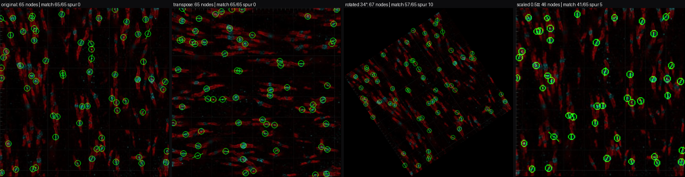
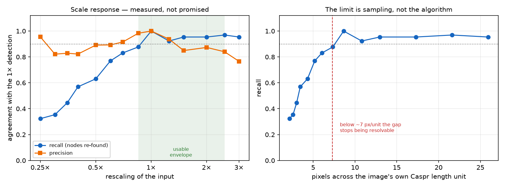

# R1 — the transform-invariance harness and what it measured

First running code in the project. Establishes the invariance requirement
([`../requirements.md`](../requirements.md) R2) as an executable test, and measures the scale
envelope R2 Tier 3 says to measure rather than promise.

Regenerate: `python3 tests/test_invariance.py`

---

## What was wrong

Nothing existed. R2 was a promise with no way to check it, and the project had no code at all.

## What changed

A **scale-free baseline detector** (`src/nor.py`) and a **transform-invariance harness**
(`src/harness.py`), pinned by `tests/test_invariance.py`.

The detector is deliberately naive — it is the baseline
[`../literature/prior-art-detection.md`](../literature/prior-art-detection.md) says anything more
elaborate must beat. Two design choices in it are not naive, and both came from looking at the
data rather than from the spec:

- **It is Nav-centric, not Caspr-pair-centric.** The spec's rule 1 reads as "find two Caspr
  regions", which suggests pairing Caspr components. Looking at a real dense field kills that:
  **the two paranodes of a node are frequently one connected Caspr component**, with the Nav blob
  inside it, so a component-pairing rule structurally cannot see them. Working outward from each
  Nav blob along the local axis handles merged and separate paranodes identically.
- **Its length unit is measured from the image.** `unit` = median Caspr component major-axis
  length. Every threshold is a multiple of it, so there is no pixel or µm constant anywhere in a
  decision rule (R1).

## Test data — and why no accuracy number appears here

The test image is a crop of Song et al. 2022 Figure 3a (sham), committed as
[`testimg-song-sham-crop.png`](testimg-song-sham-crop.png): real CNS white matter, dense,
Caspr red / Na<sub>v</sub>1.6 cyan.

It is **a re-rendered, compressed crop of a published figure, not source data**, so:

- **No accuracy figure is reported here, and none can be.** There is no ground truth, and the
  image has been through a publisher's rendering pipeline. Invariance is a property of the
  *algorithm*, which is why it can be measured on this image; accuracy is a property of the
  algorithm *on real data*, which cannot.
- The owner's own overview Figure 4 was tried as a second test image and **rejected**: it is
  saturated (>2% of pixels at 255) and JPEG-blocked, so thresholding either merges the whole field
  into 2 components or shatters it into 925. It is unusable for intensity work, and that is a fact
  about the screenshot, not about the tissue.

Using one image is a real limitation — a second, independent one is wanted the moment real data
arrives, precisely because a single image is what overfitting looks like.

## Result 1 — Tier 1 is exact, after the harness found two defects



*Original, transpose, rotated 34°, scaled 0.5×. Each panel shows that panel's own detections;
the caption reports agreement with the 1× detection after inverse mapping. Overlay hue is chosen
against the data's own colours at render time and asserted rare — see `pick_overlay` in
`src/render.py`.*

```
transform   ref  got  match  miss  spur  rms/u  unit×
-----------------------------------------------------
identity     65   65     65     0     0   0.00   1.00
transpose    65   65     65     0     0   0.00   1.00
flip-lr      65   65     65     0     0   0.00   1.00
flip-ud      65   65     65     0     0   0.00   1.00
rot90        65   65     65     0     0   0.00   1.00
rot180       65   65     65     0     0   0.00   1.00
rot34        65   67     57     8    10   0.33   1.02
rot57        65   72     59     6    13   0.34   1.01
scale0.35    65   35     29    36     6   0.66   0.38
scale0.5     65   46     41    24     5   1.06   0.52
scale0.7     65   59     54    11     5   1.04   0.72
scale1.5     65   73     62     3    11   0.40   1.48
scale2.0     65   71     62     3     9   0.18   1.93
```

**The harness earned its keep immediately by failing.** Two real defects, neither visible by
reading the code:

1. **The threshold was computed over the whole canvas.** Rotating an image pads its corners with
   black, so a "top 15% of pixels" threshold silently became far more selective — `unit×` collapsed
   to **0.36** and 67 spurious detections appeared. Fix: take every quantile over the **imaged
   area only**, tracking a validity mask through the transform. `unit×` went to 1.02 and spurious
   fell to 14.
2. **`int()` truncates toward zero, so a window built with it is not its own mirror.** This cost
   Tier-1 exactness by one pixel on flips and 90° rotations — 4 to 6 nodes each — while leaving
   transpose exact, which is what made it findable. Fix: `floor`/`ceil`, which mirror correctly as
   a pair.

Tier 1 now passes with **zero missed, zero spurious, rms 0.00** on all six resampling-free
transforms. The test asserts this with no tolerance, and reverting either fix turns it red.

## Result 2 — the scale envelope, measured



**Directly answering "should it work at 2× and at 0.5×":**

- **2× — yes.** Recall 0.95, precision 0.87.
- **0.5× — no.** Recall 0.63. And this is **not a fixable bug**: at 0.5× the image's own Caspr
  length unit is 4.3 px, so the two paranodes and the gap between them have too few samples to
  exist. No algorithm recovers a gap that is no longer in the data.

**Usable envelope: ~0.85× to ~2.5×**, for recall ≥ 0.88 and precision ≥ 0.84. Expressed in the
scale-free way that transfers to a new dataset: the detector needs roughly **7 or more pixels
across the Caspr length unit**, and degrades steadily below that.

Precision stays high (0.77–1.00) throughout — **the detector misses under downscaling rather than
hallucinating**, which is the better of the two failure modes but the wrong one for a study
counting nodes.

At the top end precision falls to 0.77 by 3×, as upsampled structures start fragmenting. So the
envelope is bounded at both ends, not just below.

## Result 3 — a calibration cross-check

The Song panel carries a 10 µm scale bar, measured at 94 px → **106 nm/px** *for the figure*.
Under that:

- `unit` (paranode major-axis measure) = **0.92 µm**
- median gap = **0.88 µm**, IQR 0.44–1.10, n = 65

Song et al.'s own sham value, read off their Figure 3g, is **~1.05 µm**.

**This number is indicative, not measured, and should not be quoted.** Four reasons, each
sufficient on its own: it comes from a compressed re-render of a published figure rather than
source data; 106 nm/px is the *figure's* sampling, not the acquisition's; the gap here is a
different definition from theirs (theirs is undefined "gap size", ours the inner-edge distance
along the fitted axis, ≈ definition E); and the detector is untuned and misses nodes, so if it
preferentially finds well-separated ones the median is biased. What it does establish is that
nothing is wrong by an order of magnitude.

## What was tried and rejected

- **Pairing Caspr components** — structurally blind to merged paranodes, which are common. See
  above.
- **The owner's overview Figure 4 as a test image** — saturated and compression-blocked, unusable
  for intensity work.
- **A global intensity threshold** — the padding-coupling defect above. A quantile over the imaged
  area is the minimum fix; a locally adaptive threshold would likely be better still and is
  untried.
- **A synthetic test field** — offered and not needed, since two real images were available in the
  ingested papers. Synthetic data would not have exposed the merged-paranode problem, which is the
  most useful thing this iteration found.

## Known limits

- **One test image.** Invariance measured on a single field is weak evidence about invariance in
  general.
- **No accuracy claim of any kind**, pending the owner's annotations.
- **Rotation recall is 0.86–0.91**, above the test's 0.80 floor but not good. Some of that is
  genuine interpolation blur; some is probably the threshold, and it has not been separated.
- **The detector is 2D.** The reference method's horizontality criterion is 3D and needs z-stacks.
- **The scale envelope is a property of this image at this sampling.** It should be re-measured on
  real data, and the operating point stated in px-per-unit rather than in ×.
